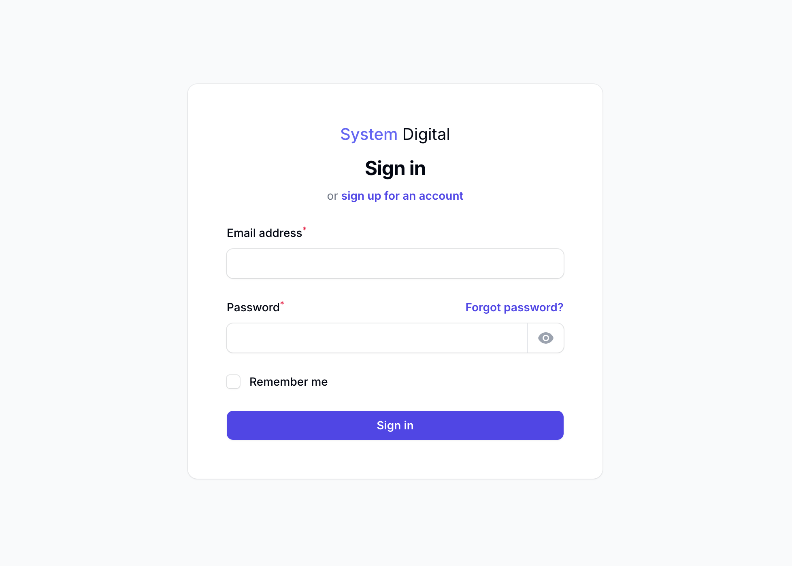
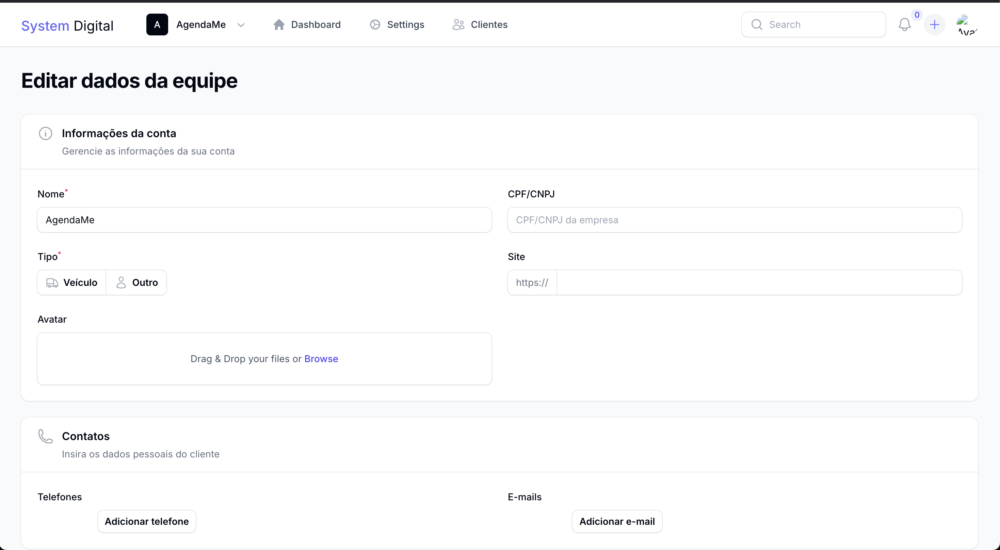
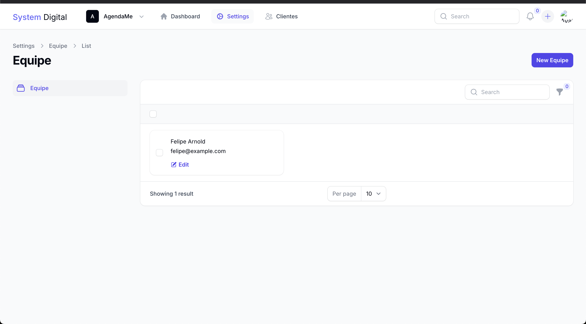
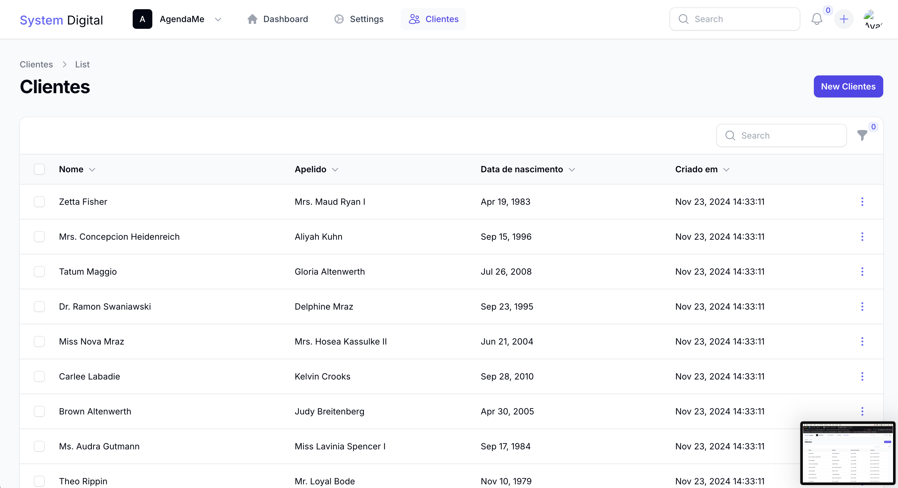

<p align="center">
    <a href="https://laravel.com" target="_blank">
        
    </a>
</p>

## Sobre o projeto

Este projeto foi desenvolvido para facilitar o inicio de um projeto multi-tenant com Laravel, e Filament.


## Login


## Configurações da empresa


## Gerenciamento de equipe


## Gerenciamento de clientes



## Instalação

1. Composer
```bash
composer install
```

2. Migrações
```bash
php artisan migrate
```

3. Seeders
```bash
php artisan db:seed
```

4. ENV
```bash
 cp .env.example .env
```

5. Key
```bash
php artisan key:generate
```
